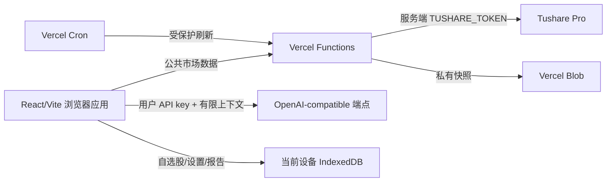

# 系统架构

tego-stock-ai 把公共市场数据、确定性研究和用户自带 AI 分成独立信任边界。服务器只负责
Tushare Pro 数据接入和快照；浏览器负责分析、AI 调用和本地持久化。

浏览器直接请求用户配置的 OpenAI-compatible 端点；AI 请求不会经过 Vercel Functions。
反过来，Tushare Token、Cron secret 和 Blob 凭据不会进入浏览器构建产物。

## 浏览器应用

React SPA 负责：

- 股票搜索、工作区导航、图表和数据状态；
- 纯函数实现的技术指标、估值、质量和趋势评分；
- 有大小上限、可验证结构的 AI 上下文和 SSE 流读取；
- IndexedDB 中的自选股、界面偏好、可选 AI 设置和报告历史；
- 本地 JSON 导出、单个报告删除、凭据清除和全部数据清除。

AI 不是基础研究的依赖。没有配置 AI 或 AI 请求失败时，规范化数据、图表和确定性指标仍然
可用。流式响应中断时只保存明确标记的草稿。

## 数据网关

物理路由与主要用途如下：

| 路由                                  | 用途                                   | 缓存边界                         |
| ------------------------------------- | -------------------------------------- | -------------------------------- |
| `GET /api/health`                     | 服务状态和 Tushare Token 是否已配置    | `no-store`；不验证权限           |
| `GET /api/market/status`              | 最近成功快照、下一预计收盘和 freshness | `no-store`                       |
| `GET /api/stocks/search?q=...`        | 代码、中文名、拼音简称搜索             | 公共 CDN 缓存                    |
| `GET /api/stocks/[code]/overview`     | 日线收盘、估值和公司概览               | 短期公共 CDN 缓存                |
| `GET /api/stocks/[code]/history`      | 最长十年的前复权 OHLCV 历史            | 公共 CDN 缓存                    |
| `GET /api/stocks/[code]/fundamentals` | 财务指标和趋势                         | 公共 CDN 缓存                    |
| `GET /api/cron/daily-close`           | 刷新全市场日线快照                     | `Authorization` 保护、`no-store` |

Vercel Functions 验证输入和 Tushare 响应，把供应商字段映射成稳定领域类型，并把外部错误
收敛为有限错误码。日志只记录 request ID、路径、状态和经过白名单校验的 provider code，
不会记录授权头、上游响应正文或查询 secret。

默认限流是在每个 Function 实例和路由内，对每个客户端 IP 尽力限制为每分钟 60 个请求；它
会随冷启动重置，也不会跨扩容实例协调，不能替代平台级 WAF 或共享限流。当前股票
search/overview/history/fundamentals 路由直接请求 Tushare adapter；公共 CDN 的
`stale-while-revalidate` 可减少重复请求，但 Blob last-good 快照只由 Cron 和
`/api/market/status` 使用，不能把它描述成所有股票路由的通用回退。

每个成功的公共数据响应都使用同一个 envelope：

- `data`：当前路由的规范化数据；
- `asOf`：数据截止日期；
- `source`：当前固定为 `Tushare Pro`；
- `freshness`：`fresh` 或 `stale`；
- `availability`：字段级可用值或缺失原因；
- `limitations`：口径、权限和非实时限制。

提供方字段到 `src/server` 为止，不会泄漏到浏览器领域接口。缺失财务字段不会被填零；依赖
它们的评分权重会从分子和分母同时移除，并向用户披露。

Tushare 权限是分层的：搜索依赖 `stock_basic`；历史依赖 `daily` 与 `adj_factor`；概览需要
`daily`/`stock_basic`，而 `daily_basic` 缺失时估值字段降级；基本面以 `fina_indicator` 为核心，
`income`/`cashflow` 缺失时现金流质量字段降级。Cron 刷新则要求 `stock_basic`、`trade_cal` 和
`daily` 全部成功。运营者必须用自己的权限组合验证，不能用 health 结果推断这些接口均可用。

## 快照和降级

Vercel Cron 在工作日收盘后读取股票目录、交易日历和当日收盘数据。通过验证的快照先写入
不可变日期/内容哈希路径，再以 ETag 条件更新 `market-snapshots/current.json` 指针。并发冲突
或提供方失败不会移动指针，因此读取端继续使用上一个成功快照（last-good snapshot），并在
超过下一预计收盘后标记为 `stale`。

Cron 的投递是尽力而为，可能遗漏或重复；快照路径和条件指针使重复刷新保持幂等。失败记录
只包含安全错误信息，不覆盖上一成功数据。

## 安全边界

- 公共 API 只接受 `GET`/`OPTIONS`，验证代码、日期、范围和查询长度，并有基本限流。
- 生产 CORS 默认只允许 Vercel production URL；`PUBLIC_APP_ORIGIN` 可覆盖为精确自定义来源。
- CSP 的脚本、frame、对象、字体和 base URL 保持同源限制；只有 `connect-src` 为 BYOK
  自定义 HTTPS 端点开放。详细权衡见 [security-csp.md](security-csp.md)。
- AI 输出解析为结构化 React 节点，不作为未清洗 HTML 注入。
- AI Base URL 不能内嵌凭据、query 或 fragment，也不能指向本项目同源 API；生产只接受 HTTPS，
  localhost/loopback 测试例外，且请求禁止自动重定向。
- v1 没有账户、服务端用户画像、云报告存储、实时行情、新闻或交易执行。
